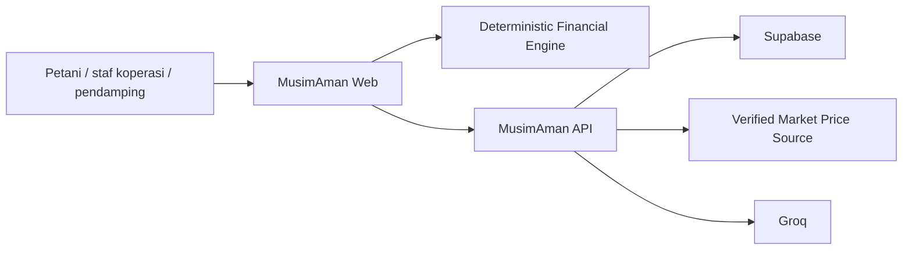
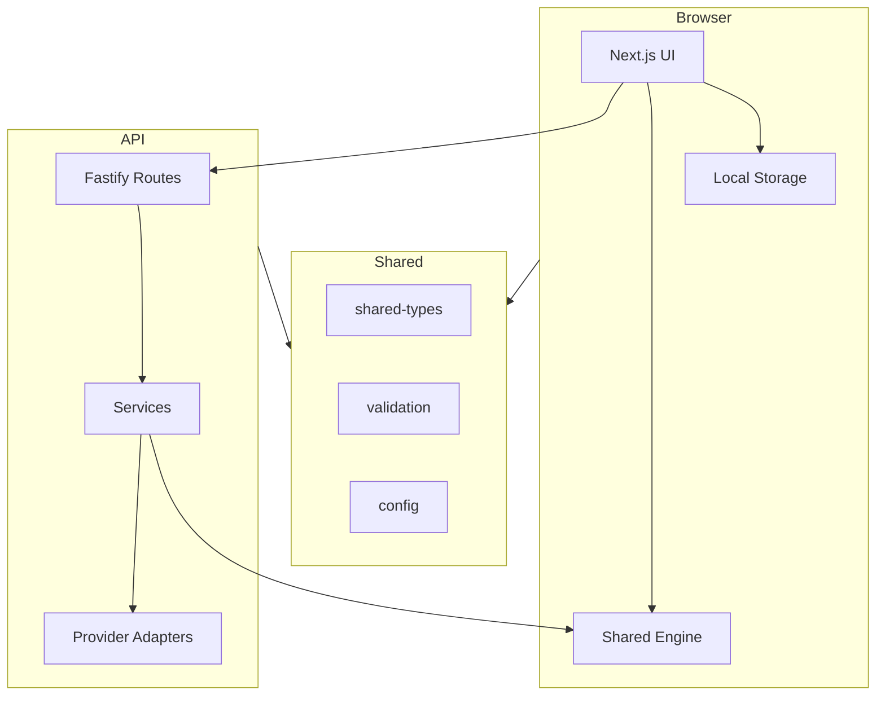
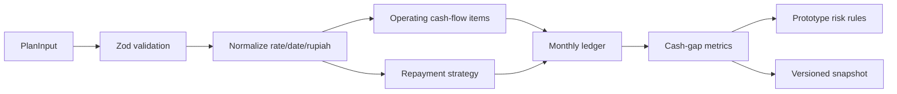
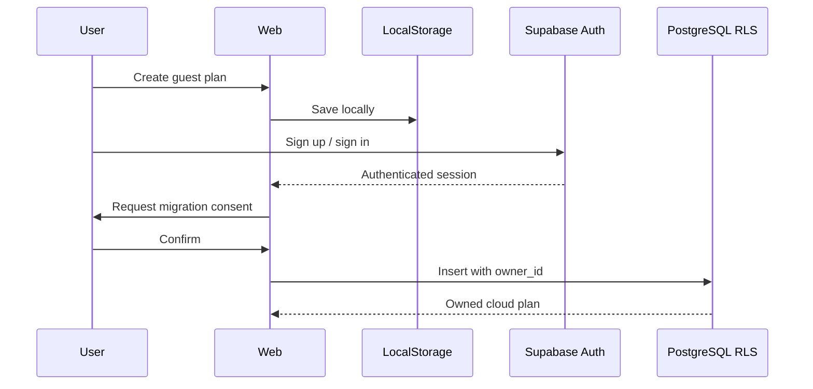
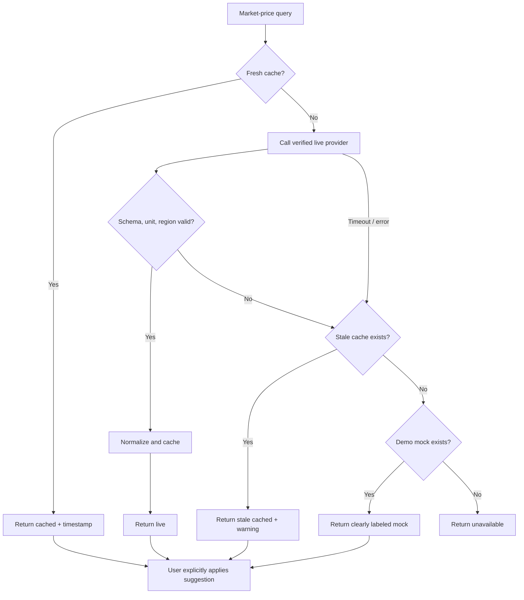
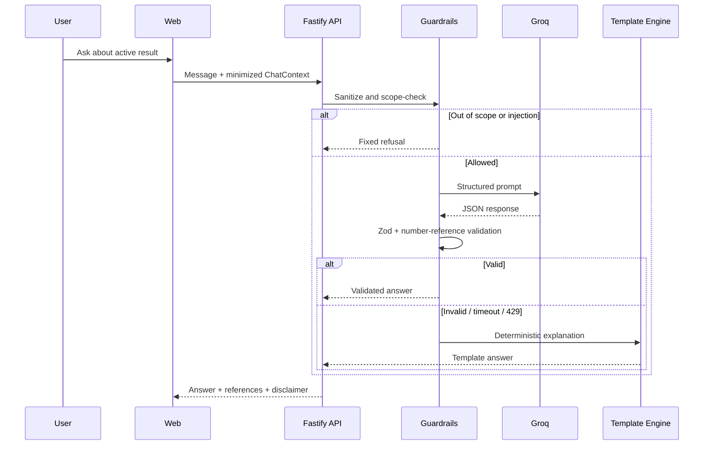
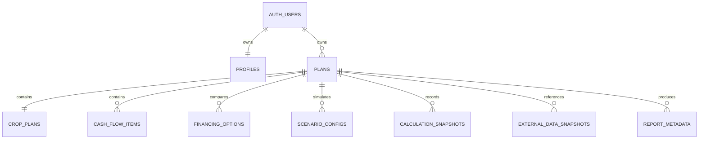
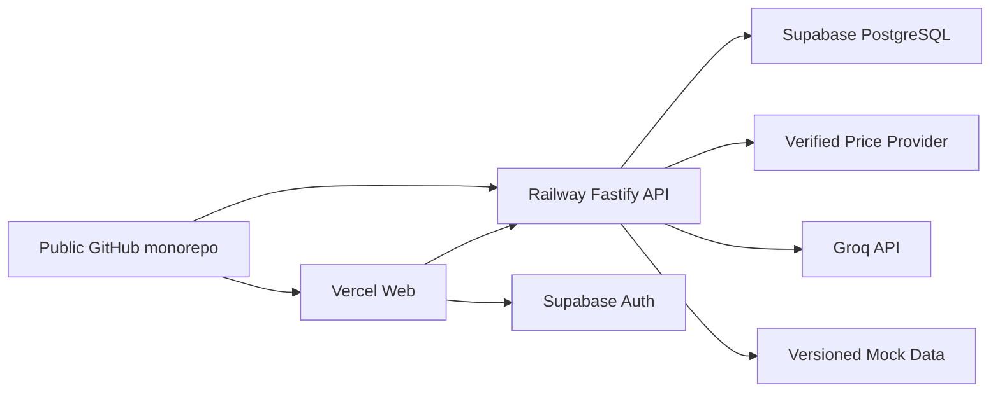

# MusimAman — Architecture Diagrams

Companion untuk `PROJECT_BLUEPRINT.md`. Diagram di bawah adalah canonical visualization dari arsitektur yang dijelaskan dalam sepuluh blueprint files.

## 1. System context

## 2. Frontend and backend architecture

## 3. Financial-engine data flow

## 4. Authentication and saved-plan flow

## 5. Market-price integration

## 6. AI chatbot request flow

## 7. Guest-mode and offline fallback

```mermaid
stateDiagram-v2
  [*] --> Guest
  Guest --> LocalPlan: Create / edit
  LocalPlan --> LocalResult: Browser engine
  LocalResult --> LocalPrint: Print report
  LocalResult --> Offline: Network unavailable
  Offline --> LocalResult: Calculation still works
  Offline --> CachedContext: Cached / mock enrichment
  Guest --> Authenticated: User signs in
  Authenticated --> CloudPlan: Explicit migration consent
  CloudPlan --> LocalPlan: API unavailable; continue locally
```

## 8. Database entity relationships

## 9. Deployment architecture

