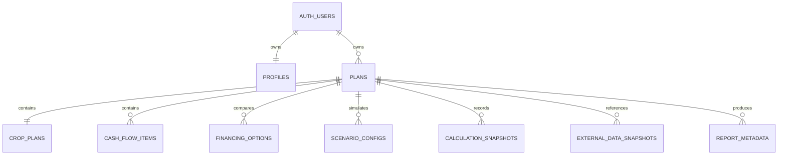

# MusimAman — Database Schema

## 1. Principles

- Supabase PostgreSQL; all public tables have RLS.
- `owner_id` references `auth.users(id)`.
- Currency uses `bigint` with non-negative checks for inputs; signed results may use `bigint`.
- API serializes PostgreSQL `bigint` as decimal string or validates conversion to JavaScript safe integer. MVP caps rupiah inputs at `Number.MAX_SAFE_INTEGER`.
- JSONB is used for versioned calculation payloads and provider snapshots, not for ownership or searchable core fields.
- Minimal personal data: no required name/phone; region only to needed precision.
- Soft delete only on `plans`; dependent rows cascade on hard account deletion.

## 2. Entity relationship



## 3. Migration SQL

```sql
create extension if not exists pgcrypto;

create table public.profiles (
  id uuid primary key references auth.users(id) on delete cascade,
  preferred_locale text not null default 'id-ID',
  created_at timestamptz not null default now(),
  updated_at timestamptz not null default now(),
  constraint profiles_locale_check check (preferred_locale in ('id-ID'))
);

create table public.plans (
  id uuid primary key default gen_random_uuid(),
  owner_id uuid not null references auth.users(id) on delete cascade,
  title text not null check (char_length(title) between 1 and 100),
  province_code text not null,
  regency_code text not null,
  district_code text,
  schema_version integer not null default 1 check (schema_version > 0),
  status text not null default 'draft'
    check (status in ('draft','complete','archived')),
  notes text check (char_length(notes) <= 2000),
  deleted_at timestamptz,
  created_at timestamptz not null default now(),
  updated_at timestamptz not null default now()
);

create index plans_owner_updated_idx
  on public.plans(owner_id, updated_at desc)
  where deleted_at is null;

create table public.crop_plans (
  id uuid primary key default gen_random_uuid(),
  plan_id uuid not null unique references public.plans(id) on delete cascade,
  owner_id uuid not null references auth.users(id) on delete cascade,
  crop_type text not null
    check (crop_type in ('rice','corn','chili','coffee','palm_oil')),
  template_version text not null,
  planting_date date not null,
  estimated_harvest_date date not null,
  cycle_duration_days integer not null check (cycle_duration_days > 0),
  production_phases jsonb not null default '[]'::jsonb,
  expected_harvest_quantity numeric(18,3) not null check (expected_harvest_quantity >= 0),
  quantity_unit text not null,
  expected_selling_price_rupiah bigint not null check (expected_selling_price_rupiah >= 0),
  expected_total_harvest_income_rupiah bigint not null check (expected_total_harvest_income_rupiah >= 0),
  assumptions jsonb not null default '[]'::jsonb,
  created_at timestamptz not null default now(),
  updated_at timestamptz not null default now(),
  constraint crop_dates_check check (estimated_harvest_date > planting_date)
);

create index crop_plans_owner_idx on public.crop_plans(owner_id);

create table public.cash_flow_items (
  id uuid primary key default gen_random_uuid(),
  plan_id uuid not null references public.plans(id) on delete cascade,
  owner_id uuid not null references auth.users(id) on delete cascade,
  item_type text not null check (item_type in ('income','production_expense')),
  category text not null,
  amount_rupiah bigint not null check (amount_rupiah >= 0),
  timing_date date not null,
  description text check (char_length(description) <= 300),
  is_harvest_income boolean not null default false,
  created_at timestamptz not null default now(),
  updated_at timestamptz not null default now()
);

create index cash_flow_items_plan_date_idx
  on public.cash_flow_items(plan_id, timing_date);
create index cash_flow_items_owner_idx on public.cash_flow_items(owner_id);

create table public.financing_options (
  id uuid primary key default gen_random_uuid(),
  plan_id uuid not null references public.plans(id) on delete cascade,
  owner_id uuid not null references auth.users(id) on delete cascade,
  name text not null check (char_length(name) between 1 and 100),
  principal_rupiah bigint not null check (principal_rupiah >= 0),
  interest_rate_bps integer not null check (interest_rate_bps between 0 and 100000),
  interest_period text not null check (interest_period in ('MONTHLY','ANNUAL')),
  administration_fee_rupiah bigint not null default 0 check (administration_fee_rupiah >= 0),
  other_upfront_fees_rupiah bigint not null default 0 check (other_upfront_fees_rupiah >= 0),
  financing_start_date date not null,
  grace_period_months integer not null default 0 check (grace_period_months >= 0),
  number_of_installments integer not null check (number_of_installments > 0),
  repayment_frequency text not null check (repayment_frequency in ('MONTHLY','ONCE')),
  repayment_structure text not null check (repayment_structure in ('FLAT_MONTHLY','BULLET')),
  first_repayment_date date not null,
  created_at timestamptz not null default now(),
  updated_at timestamptz not null default now(),
  constraint financing_dates_check check (first_repayment_date >= financing_start_date)
);

create index financing_options_plan_idx on public.financing_options(plan_id);
create index financing_options_owner_idx on public.financing_options(owner_id);

create table public.scenario_configs (
  id uuid primary key default gen_random_uuid(),
  plan_id uuid not null references public.plans(id) on delete cascade,
  owner_id uuid not null references auth.users(id) on delete cascade,
  name text not null,
  mode text not null check (mode in ('EXPECTED','MILD','SEVERE','CUSTOM')),
  enabled_harvest_delay boolean not null default false,
  harvest_delay_months integer not null default 0 check (harvest_delay_months between 0 and 24),
  enabled_income_reduction boolean not null default false,
  harvest_income_reduction_bps integer not null default 0
    check (harvest_income_reduction_bps between 0 and 10000),
  enabled_input_increase boolean not null default false,
  input_cost_increase_bps integer not null default 0
    check (input_cost_increase_bps between 0 and 100000),
  config_version text not null default 'prototype-1',
  created_at timestamptz not null default now(),
  updated_at timestamptz not null default now()
);

create index scenario_configs_plan_idx on public.scenario_configs(plan_id);
create index scenario_configs_owner_idx on public.scenario_configs(owner_id);

create table public.calculation_snapshots (
  id uuid primary key default gen_random_uuid(),
  plan_id uuid not null references public.plans(id) on delete cascade,
  owner_id uuid not null references auth.users(id) on delete cascade,
  financing_option_id uuid references public.financing_options(id) on delete set null,
  original_input jsonb not null,
  normalized_input jsonb not null,
  result jsonb not null,
  scenario_config jsonb not null,
  engine_version text not null,
  risk_config_version text not null,
  input_checksum text not null,
  created_at timestamptz not null default now()
);

create index calculation_snapshots_plan_created_idx
  on public.calculation_snapshots(plan_id, created_at desc);
create index calculation_snapshots_owner_idx on public.calculation_snapshots(owner_id);

create table public.external_data_snapshots (
  id uuid primary key default gen_random_uuid(),
  plan_id uuid references public.plans(id) on delete cascade,
  owner_id uuid references auth.users(id) on delete cascade,
  provider text not null,
  data_type text not null check (data_type = 'market_price'),
  region_code text not null,
  commodity text,
  source text not null,
  status text not null check (status in ('live','cached','mock','unavailable')),
  data_date timestamptz,
  last_checked_at timestamptz not null,
  raw_reference_id text,
  normalized_payload jsonb not null,
  schema_version integer not null default 1,
  expires_at timestamptz,
  created_at timestamptz not null default now(),
  constraint external_owner_check check (
    (plan_id is null and owner_id is null) or
    (plan_id is not null and owner_id is not null)
  )
);

create index external_cache_lookup_idx
  on public.external_data_snapshots(provider, data_type, region_code, commodity, last_checked_at desc);
create index external_owner_idx on public.external_data_snapshots(owner_id)
  where owner_id is not null;

create table public.report_metadata (
  id uuid primary key default gen_random_uuid(),
  plan_id uuid not null references public.plans(id) on delete cascade,
  owner_id uuid not null references auth.users(id) on delete cascade,
  calculation_snapshot_id uuid references public.calculation_snapshots(id) on delete set null,
  anonymous_farmer_identifier text,
  engine_version text not null,
  report_version integer not null default 1,
  created_at timestamptz not null default now()
);

create index report_metadata_plan_idx on public.report_metadata(plan_id);
create index report_metadata_owner_idx on public.report_metadata(owner_id);
```

Application validation must also confirm every child `owner_id` equals parent plan `owner_id`; database trigger may be added after MVP.

## 4. Updated-at trigger

```sql
create or replace function public.set_updated_at()
returns trigger language plpgsql as $$
begin
  new.updated_at = now();
  return new;
end;
$$;

-- Apply to mutable tables: profiles, plans, crop_plans,
-- cash_flow_items, financing_options, scenario_configs.
```

## 5. RLS

Enable:

```sql
alter table public.profiles enable row level security;
alter table public.plans enable row level security;
alter table public.crop_plans enable row level security;
alter table public.cash_flow_items enable row level security;
alter table public.financing_options enable row level security;
alter table public.scenario_configs enable row level security;
alter table public.calculation_snapshots enable row level security;
alter table public.external_data_snapshots enable row level security;
alter table public.report_metadata enable row level security;
```

Profiles:

```sql
create policy profiles_select_own on public.profiles
for select to authenticated using ((select auth.uid()) = id);
create policy profiles_insert_own on public.profiles
for insert to authenticated with check ((select auth.uid()) = id);
create policy profiles_update_own on public.profiles
for update to authenticated
using ((select auth.uid()) = id)
with check ((select auth.uid()) = id);
```

Owned-table template, apply to `plans` and every child with `owner_id`:

```sql
create policy TABLE_select_own on public.TABLE
for select to authenticated using ((select auth.uid()) = owner_id);

create policy TABLE_insert_own on public.TABLE
for insert to authenticated with check ((select auth.uid()) = owner_id);

create policy TABLE_update_own on public.TABLE
for update to authenticated
using ((select auth.uid()) = owner_id)
with check ((select auth.uid()) = owner_id);

create policy TABLE_delete_own on public.TABLE
for delete to authenticated using ((select auth.uid()) = owner_id);
```

For `calculation_snapshots`, allow select/insert/delete but no update; snapshots are immutable. For shared provider cache rows where `owner_id is null`, do not grant anon table access; backend service reads with service role and returns normalized DTO.

Supabase requires RLS on exposed tables; reference: <https://supabase.com/docs/guides/database/postgres/row-level-security>.

## 6. Soft delete

User “Delete plan” sets `deleted_at` for immediate recovery during session; default queries filter it. “Delete permanently” or account deletion performs hard delete and cascade. Child tables do not need their own `deleted_at`.

## 7. Snapshot policy

Persist a calculation snapshot only when authenticated user explicitly saves or prints a cloud plan. It contains original/normalized input, output, scenario, and versions. Historical reports read the stored snapshot; they are never silently recalculated by a newer engine.

## 8. Future columns, not MVP behavior

Future migrations may add:

- `organizations`, `organization_members`;
- `plan_access_grants` with farmer consent and expiry;
- verified financing templates;
- advisory content versioning;
- locale preferences and audit events.

Do not add organization authorization to hackathon UI.
