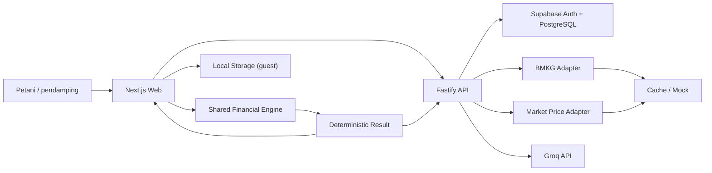
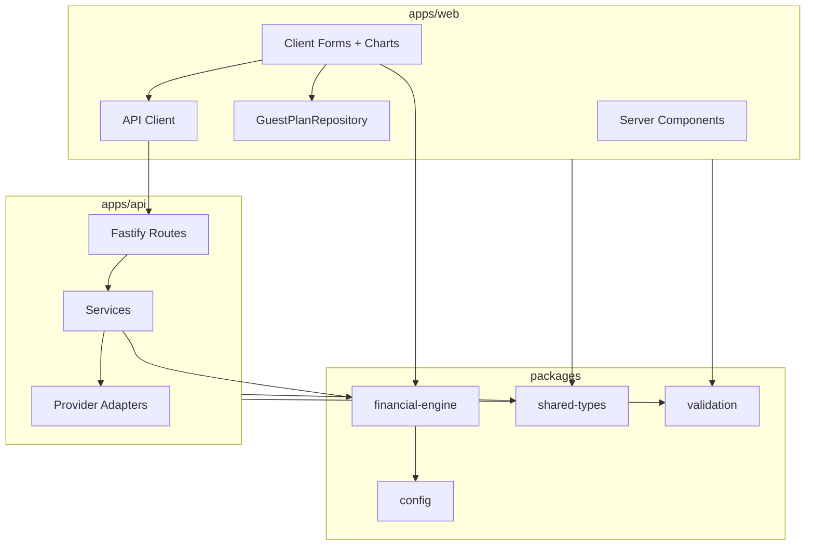
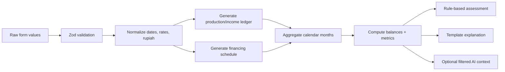
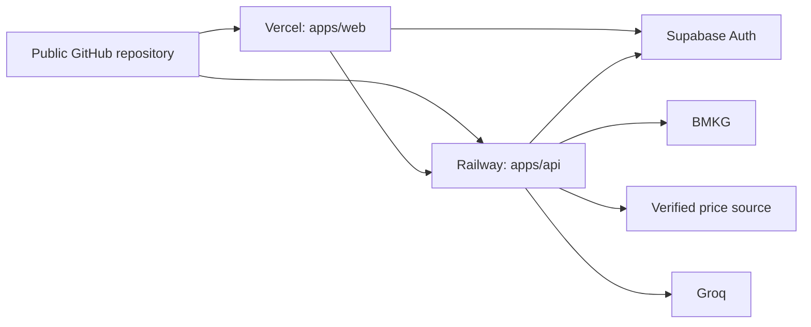

# MusimAman — Project Blueprint

Dokumen ini adalah dokumen induk implementasi MusimAman. Gunakan bersama:

- [FRONTEND_BLUEPRINT.md](./FRONTEND_BLUEPRINT.md)
- [BACKEND_BLUEPRINT.md](./BACKEND_BLUEPRINT.md)
- [AI_INTEGRATION.md](./AI_INTEGRATION.md)
- [FINANCIAL_ENGINE.md](./FINANCIAL_ENGINE.md)
- [API_DOCUMENTATION.md](./API_DOCUMENTATION.md)
- [DATABASE_SCHEMA.md](./DATABASE_SCHEMA.md)
- [TESTING_GUIDE.md](./TESTING_GUIDE.md)
- [DEMO_AND_SUBMISSION.md](./DEMO_AND_SUBMISSION.md)
- [README.md](./README.md)

## 1. Keputusan produk

**Nama:** MusimAman  
**Nilai utama:** membantu petani melihat apakah kebutuhan produksi, kebutuhan minimum rumah tangga, dan kewajiban pembiayaan tetap dapat dipenuhi ketika waktu panen atau nilai pendapatan berubah.  
**Pengguna utama:** petani kecil Indonesia; staf koperasi dan pendamping keuangan sebagai assisted users.  
**Batas produk:** alat simulasi dan bahan diskusi, bukan pemberi pinjaman, credit scoring, persetujuan kredit, prediksi hasil panen, atau nasihat keuangan.

Teks wajib pada hasil dan laporan:

> Alat bantu diskusi, bukan persetujuan kredit atau nasihat keuangan. Semua skenario adalah simulasi berdasarkan asumsi pengguna.

Istilah hasil:

- `Relatively Resilient` → **Relatif Tahan**
- `Needs Adjustment` → **Perlu Penyesuaian**
- `High Cash-Flow Risk` → **Risiko Arus Kas Tinggi**

Jangan gunakan “pasti aman”, “pasti mampu membayar”, “disetujui”, “ditolak”, atau “AI menjamin”.

## 2. Pembagian kelompok kerja

### Frontend dan UI/UX

- Design system, layout mobile-first, accessibility, responsive behavior.
- Three-step flow: farm/household, financing, result/comparison.
- Guest mode, local plans, authentication UI, saved-plan UI.
- Cash-flow charts, risk breakdown, scenario controls, comparison.
- AI chat panel, external-data status, printable report, demo mode.
- Loading, error, empty, offline, cached, mock, and unavailable states.
- Frontend unit/component tests dan critical-flow E2E.

### Backend, AI, dan data

- Fastify REST API, OpenAPI, validation, security, logging, rate limiting.
- Supabase Auth integration, RLS, persistence, migrations.
- Shared financial-engine integration dan verification snapshots.
- BMKG dan market-price provider adapters, cache, normalization, fallback.
- Groq gateway, context minimization, guardrails, structured output validation.
- Risk-assessment orchestration, configuration, mock datasets.
- Backend tests, API failure simulation, financial calculation audit.

Testing, README, Devpost, video, dan presentasi adalah tanggung jawab bersama.

## 3. Scope freeze

### Must-have

1. Lima editable crop templates: rice, corn, chili, coffee, palm oil.
2. Guest-first flow dengan local storage.
3. Supabase email/password authentication dan saved-plan CRUD.
4. Production, household, non-farm income, opening balance, dan financing input.
5. Flat monthly installment dan bullet/post-harvest repayment.
6. Deterministic monthly engine dengan integer rupiah.
7. Expected, mild, severe, custom, dan combined scenarios.
8. Side-by-side comparison untuk dua financing options.
9. Configurable rule-based resilience assessment.
10. BMKG live/cached/mock/unavailable adapter.
11. Market-price verified-source/fallback adapter.
12. Groq contextual explanation dengan template fallback.
13. Browser-print report.
14. Synthetic one-click rice demo.

### Tidak dikerjakan dalam 24 jam

- Loan application, lender marketplace, pembayaran, e-KYC.
- ML credit model atau probabilitas gagal bayar.
- Automatic yield-loss prediction.
- Scraping website harga yang tidak menyediakan izin atau kontrak stabil.
- Organization roles, counselor sharing, real-time collaboration.
- Full offline synchronization/service-worker conflict resolution.
- Effective-interest dan annuity implementation; hanya interface dan test placeholder.
- PDF service, vector database, RAG, WhatsApp integration.

## 4. Arsitektur yang dipilih

- **Monorepo:** `pnpm` workspaces.
- **Web:** Next.js App Router, TypeScript, Tailwind, shadcn/ui, React Hook Form, Zod, Recharts.
- **API:** Fastify + TypeScript di Railway. Fastify dipilih karena built-in structured logging dan schema-oriented API; Railway memiliki alur deployment Fastify langsung. Bind ke `host: "::"` saat deployment.
- **Data/Auth:** Supabase PostgreSQL dan email/password. Email/password dipilih agar demo auth tidak bergantung pada keterlambatan email magic link. Guest mode tetap jalur utama.
- **Engine:** pure TypeScript package tanpa network/database access; dipakai oleh web dan API.
- **AI:** Groq hanya melalui API backend; default model dari `GROQ_MODEL`. Gunakan Structured Outputs strict hanya bila model yang dipilih mendukungnya, lalu tetap validasi dengan Zod.
- **Deploy:** Vercel untuk web, Railway untuk API, Supabase managed project.

### System context



### Frontend dan backend



## 5. Repository structure

```text
musimaman/
├── apps/
│   ├── web/
│   │   ├── app/
│   │   ├── components/
│   │   ├── features/
│   │   ├── lib/
│   │   ├── public/demo/
│   │   └── tests/
│   └── api/
│       ├── src/routes/
│       ├── src/services/
│       ├── src/providers/
│       ├── src/plugins/
│       ├── src/mocks/
│       └── tests/
├── packages/
│   ├── financial-engine/
│   │   ├── src/
│   │   └── tests/
│   ├── shared-types/src/
│   ├── validation/src/
│   └── config/src/
├── docs/
├── supabase/
│   ├── migrations/
│   └── seed.sql
├── scripts/
├── .github/workflows/ci.yml
├── .env.example
├── package.json
├── pnpm-workspace.yaml
└── README.md
```

Tanggung jawab folder:

- `apps/web`: UI, local persistence, browser calculation, auth client, print.
- `apps/api`: secrets, Groq, external providers, cache, authenticated gateway.
- `financial-engine`: normalization, repayment schedule, monthly ledger, metrics, scenario transforms, risk rules.
- `shared-types`: domain interfaces dan API DTO.
- `validation`: shared Zod schemas; tidak berisi business calculation.
- `config`: crop templates, prototype thresholds, category mappings, engine version.
- `supabase`: reproducible schema, RLS, seed data.
- `docs`: blueprint dan source register.
- `scripts`: deterministic validation/seed helpers; bukan runtime dependency.

## 6. Major implementation tasks

| Task | Objective | Priority | Owner | Input → Output | Dependencies | Acceptance / DoD | Main risk | Fallback |
|---|---|---:|---|---|---|---|---|---|
| Shared contracts | Satu bentuk data lintas web/API/DB | P0 | Shared | Requirements → types/Zod | None | Web dan API compile memakai types yang sama | Schema churn | Freeze v1 fields |
| Financial engine | Menghasilkan ledger dan metrics deterministik | P0 | Backend/data | `CalculationInput` → `CashFlowResult` | Shared contracts | Unit tests exact; no float currency | Formula error | Disable untested structures |
| Primary flow | Menyelesaikan plan dalam tiga langkah | P0 | Frontend | Templates/forms → normalized plan | Types/validation | Android-width flow complete | Form overload | Progressive sections |
| Scenarios | Immutable transformations dan combined simulation | P0 | Shared | Base input + config → scenario results | Engine | Three defaults editable and combinable | Mutation bugs | Deep-copy normalization |
| Comparison | Membandingkan dua options dengan same base plan | P0 | Shared | 2 financing options → comparison | Engine | All required fields shown | False recommendation | “More resilient by rules”, no lender choice |
| Guest persistence | Full local workflow | P0 | Frontend | Plan → versioned local JSON | Validation | Reload restores data; corrupt entry isolated | Schema upgrade | Clear invalid local data with confirmation |
| Auth/CRUD | Cloud persistence with ownership | P0 | Both | Supabase session + plan → saved record | Supabase/RLS | CRUD and migration pass | Email/auth outage | Guest remains functional |
| External context | Enrichment without blocking | P0 | Backend/data | Region/commodity → status envelope | Providers/cache | Live or labeled fallback displayed | Source changes | Dated mock JSON |
| Chat explanation | Explain validated results only | P0 | Backend/AI | Filtered `ChatContext` → validated response | Groq + templates | Refuses unrelated/injection; no invented numbers | Hallucination/timeout | Deterministic templates |
| Print report | Shareable discussion sheet | P0 | Frontend | Current plan/result → print view | Engine/results | A4 and mobile preview, no PII by default | Browser variance | Chrome print target |
| Demo mode | Reliable two-minute story | P0 | Shared | Seed JSON → complete journey | All core features | One click, labeled synthetic | Seed inconsistency | Snapshot expected outputs |

Untuk setiap P0 task, “Done” berarti code merged ke default branch, tests relevan lulus, empty/error/fallback state tersedia, dan seeded demo tidak rusak.

## 7. Core data flow



Source of truth hanya output `packages/financial-engine`. UI, database, dan AI tidak boleh menghitung ulang dengan formula berbeda.

## 8. External-data policy

### BMKG

Forecast API resmi menyediakan JSON tiga hari per tiga jam untuk kode `adm4`, diperbarui dua kali sehari, limit 60 request/menit/IP, dan wajib menampilkan atribusi BMKG. Nowcast warning menggunakan CAP XML. Dokumentasi: <https://data.bmkg.go.id/prakiraan-cuaca/> dan <https://data.bmkg.go.id/peringatan-dini-cuaca/>.

MVP hanya mengaktifkan live forecast untuk region mapping yang memiliki verified `adm4`. Jika input berhenti pada kabupaten/kota, tampilkan fallback regional atau `unavailable`; jangan mengarang village code.

### Harga

Prioritas sumber adalah Bapanas Open Data/Panel Harga. Saat blueprint disusun, panel dapat berada dalam maintenance dan beberapa dataset diberi akses terbatas. Karena tidak ada public API contract stabil yang boleh diasumsikan, dilarang membuat undocumented scraper. Implementasi:

1. `BapanasOpenDataProvider` hanya aktif bila CSV/JSON URL, lisensi, unit, coverage, dan update frequency diverifikasi pada hari hackathon.
2. Rice/corn/chili dapat memakai snapshot resmi bertanggal bila tersedia.
3. Coffee/palm oil memakai verified BPS/Kementan/commodity source bila tersedia; jika tidak, synthetic fallback.
4. Semua fallback berada di repo, berlabel `mock`, dan bukan “harga hari ini”.

Referensi awal: <https://data.badanpangan.go.id/> dan <https://panelharga.badanpangan.go.id/beranda>.

## 9. Guest, auth, dan saved-plan flow

```mermaid
sequenceDiagram
  participant U as User
  participant W as Web
  participant L as LocalStorage
  participant A as Supabase Auth
  participant D as PostgreSQL + RLS
  U->>W: Try Demo / Create Plan
  W->>L: Save versioned guest plan
  U->>A: Sign up / Sign in
  A-->>W: Session
  W->>U: Ask consent to migrate
  U->>W: Confirm
  W->>D: Insert owned plan
  D-->>W: Saved plan id
  W->>L: Mark migrated; retain until user confirms removal
```

Cloud save selalu explicit. Guest financial data tidak dikirim ke API untuk calculation. Chat membutuhkan explicit action dan hanya mengirim filtered context yang ditampilkan kepada pengguna.

## 10. Deployment



Railway service:

- root/repo build memakai workspace filters;
- `PORT` dari Railway;
- Fastify `listen({ port, host: "::" })`;
- health probe `/api/v1/health`;
- CORS hanya Vercel production URL dan localhost development.

## 11. Environment variables

```dotenv
NODE_ENV=development
NEXT_PUBLIC_APP_URL=http://localhost:3000
NEXT_PUBLIC_API_URL=http://localhost:4000
NEXT_PUBLIC_SUPABASE_URL=
NEXT_PUBLIC_SUPABASE_PUBLISHABLE_KEY=

API_HOST=::
API_PORT=4000
WEB_ORIGIN=http://localhost:3000
LOG_LEVEL=info
TRUST_PROXY=false

SUPABASE_URL=
SUPABASE_PUBLISHABLE_KEY=
SUPABASE_SERVICE_ROLE_KEY=

GROQ_API_KEY=
GROQ_MODEL=openai/gpt-oss-20b
GROQ_TIMEOUT_MS=8000
CHAT_MAX_INPUT_CHARS=1200
CHAT_RATE_LIMIT_PER_MINUTE=5

BMKG_FORECAST_BASE_URL=https://api.bmkg.go.id/publik/prakiraan-cuaca
BMKG_NOWCAST_FEED_URL=https://www.bmkg.go.id/alerts/nowcast/id
BMKG_TIMEOUT_MS=3500
EXTERNAL_CACHE_TTL_SECONDS=21600

MARKET_PRICE_PROVIDER=mock
MARKET_PRICE_BASE_URL=
MARKET_PRICE_TIMEOUT_MS=3500

ENGINE_VERSION=1.0.0
RISK_CONFIG_VERSION=prototype-1
DEMO_DATA_VERSION=1
```

`SUPABASE_SERVICE_ROLE_KEY` dan `GROQ_API_KEY` hanya berada di backend. Semua variables divalidasi saat process startup.

## 12. 24-hour roadmap

| Phase | Frontend workstream | Backend/AI workstream | Shared work | Exit criteria | Jika tertinggal |
|---|---|---|---|---|---|
| 0:00–0:30 | App shell init | API shell init | Public repo, scope freeze, initial commit | Both apps start | No styling |
| 0:30–2:00 | Wireframe three-step flow | Data contracts, schema draft | Shared types, demo numbers | Contracts frozen | One rice template first |
| 2:00–6:00 | Farm/household and financing forms | Engine + exact tests | Integrate validation | Expected calculation rendered | No auth yet |
| 6:00–10:00 | Result chart, scenarios | Fastify, Supabase migration/auth | Financial audit #1 | Three scenarios work | API returns mock only |
| 10:00–14:00 | Comparison, saved plans | CRUD/RLS, adapters/cache | Guest migration test | Comparison + CRUD | Basic CRUD; cached providers |
| 14:00–17:00 | Chat panel, print view | Groq guardrails/templates | Injection/refusal tests | Chat or fallback explains result | Template-only AI if needed |
| 17:00–19:00 | Five templates, offline/error states | Fallback datasets/status | Demo snapshot verification | One-click demo complete | Templates share default phase pattern |
| 19:00–21:00 | Mobile/a11y fixes | API/security/failure tests | E2E/manual run, financial audit #2 | Critical flow passes | Manual test instead of Playwright |
| 21:00–22:30 | UI screenshots | OpenAPI/source register | README/docs/AI disclosure | Submission docs complete | Diagrams stay in Markdown |
| 22:30–23:30 | Record UI flow | Monitor logs/fallback | Video/Devpost | Two-minute video exists | One-take capture |
| 23:30–24:00 | Production smoke test | Health/data fallback check | Final commit and link verification | Submission-ready freeze | No new features |

Semua must-have tetap “ada” saat simplification: live source → dated fallback; PDF → browser print; ML → rules; vector DB → filtered context; service worker → local storage; advanced roles → owner-only CRUD.

## 13. Project-wide Definition of Done

- Lima crop templates dapat dipilih dan diedit.
- Guest user dapat membuat, menghitung, menyimpan lokal, reload, compare, chat, dan print.
- Email/password auth dan plan CRUD bekerja; local plan dapat dimigrasikan dengan consent.
- RLS membatasi seluruh owned rows.
- Expected result, tiga skenario, dan combined scenario lulus tests.
- Dua financing plans dapat dibandingkan.
- Cash gap, first gap month, minimum balance, dan assumptions terlihat.
- BMKG dan market price menunjukkan `source`, `dataDate`, `lastCheckedAt`, `region`, dan `status`; fallback berlabel.
- Groq hanya menjelaskan structured context; out-of-scope dan injection ditolak; template fallback bekerja.
- AI tidak menghasilkan atau mengubah angka engine.
- Browser-print report memuat engine/config version dan disclaimer.
- Rice demo menghasilkan expected snapshot yang disepakati.
- Mobile layout, keyboard navigation, non-color statuses, dan accessible labels diperiksa.
- Financial unit tests dan critical-flow E2E/manual script lulus.
- Production web dan API health check bekerja.
- Public repository memiliki initial, MVP, dan final verified commits.
- README, data-source register, licenses, AI disclosure, Devpost, dan two-minute video selesai.

## 14. Future-ready boundaries

Interface saat ini disiapkan untuk `organization_id`, consent grants, provider adapters, repayment strategy registry, versioned scenario/risk configs, dan localized strings. Implementasi MVP tetap owner-only. Setelah hackathon, tambahkan secara berurutan: expert validation, counselor sharing, verified financing templates, historical data, organization roles, more repayment strategies, offline sync, regional languages, WhatsApp share, dan audit-retained calculation versions.

Setiap future feature harus tetap membaca historical snapshot menggunakan `engine_version` dan `schema_version`; jangan menghitung ulang laporan lama secara diam-diam dengan formula baru.
