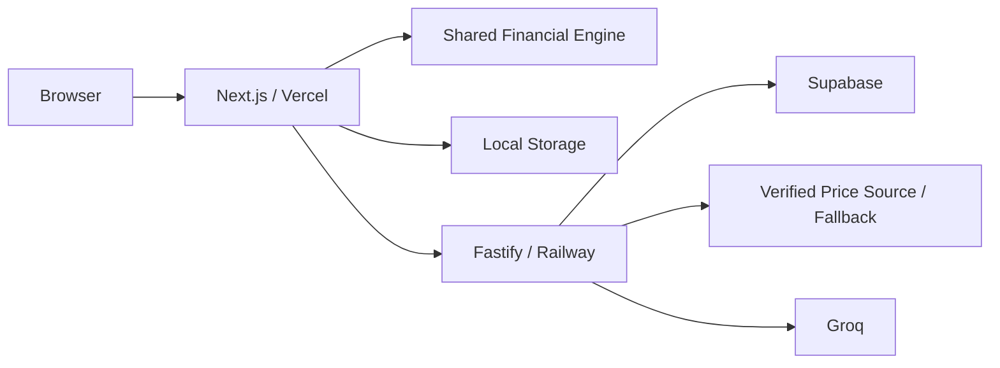

# MusimAman

MusimAman adalah web app simulasi arus kas musiman untuk membantu petani kecil Indonesia dan pendampingnya memahami apakah kebutuhan produksi, kebutuhan minimum rumah tangga, dan kewajiban pembiayaan tetap dapat dipenuhi ketika panen terlambat, pendapatan panen turun, atau biaya input naik.

> Alat bantu diskusi, bukan persetujuan kredit atau nasihat keuangan. Semua skenario adalah simulasi berdasarkan asumsi pengguna.

## Problem

Pendapatan pertanian sering terkonsentrasi saat panen, sedangkan biaya produksi, rumah tangga, dan repayment dapat jatuh lebih awal. Perbandingan loan generik yang hanya melihat total income/cost dapat melewatkan cash gap pada bulan tertentu.

## Core features

- Editable templates: rice, corn, chili, coffee, palm oil.
- Production, household, opening balance, reserve, and non-farm entries.
- Flat monthly dan bullet/post-harvest financing.
- Deterministic TypeScript cash-flow engine.
- Expected, mild, severe, custom, and combined stress scenarios.
- Transparent resilience assessment dan two-option comparison.
- Guest-first local storage dan Supabase saved-plan CRUD.
- Market-price context with visible live/cached/mock/unavailable status.
- Groq contextual explanation with rule-template fallback.
- Print-friendly discussion report dan one-click synthetic demo.

## Screenshots

Add real screenshots after implementation:

- `docs/images/landing.png`
- `docs/images/expected-result.png`
- `docs/images/delayed-harvest-gap.png`
- `docs/images/financing-comparison.png`
- `docs/images/print-report.png`

Do not commit fake UI screenshots.

## Architecture



Core calculation runs in the browser and API. External services enrich but never block it.

## Repository

```text
apps/web                 Next.js UI, guest mode, print, auth client
backend                  Fastify API, Supabase, providers, Groq gateway
packages/financial-engine  Source of truth for calculations
packages/shared-types    Domain and API types
packages/validation      Shared Zod schemas
packages/config          Crop/risk/scenario configuration
backend/supabase/migrations PostgreSQL schema and RLS
docs                     Architecture, sources, submission assets
```

Complete build blueprint:

- [PROJECT_BLUEPRINT.md](./PROJECT_BLUEPRINT.md)
- [FRONTEND_BLUEPRINT.md](./FRONTEND_BLUEPRINT.md)
- [BACKEND_BLUEPRINT.md](./BACKEND_BLUEPRINT.md)
- [FINANCIAL_ENGINE.md](./FINANCIAL_ENGINE.md)
- [AI_INTEGRATION.md](./AI_INTEGRATION.md)
- [API_DOCUMENTATION.md](./API_DOCUMENTATION.md)
- [DATABASE_SCHEMA.md](./DATABASE_SCHEMA.md)
- [TESTING_GUIDE.md](./TESTING_GUIDE.md)
- [DEMO_AND_SUBMISSION.md](./DEMO_AND_SUBMISSION.md)

## Technology

- Next.js App Router, TypeScript, Tailwind, shadcn/ui.
- React Hook Form, Zod, Zustand, Recharts.
- Fastify, OpenAPI, structured logging, rate limiting.
- Supabase PostgreSQL/Auth/RLS.
- Vitest and Playwright.
- Vercel, Railway, pnpm workspaces.

## Local setup

Prerequisites: currently supported Node.js LTS, pnpm, Supabase project or local Supabase tooling.

```bash
pnpm install
cp .env.example .env
pnpm dev
```

Expected local URLs:

- Web: `http://localhost:3000`
- API: `http://localhost:4000`
- API docs: `http://localhost:4000/documentation`

Exact scripts must be defined in root `package.json`:

```json
{
  "scripts": {
    "dev": "pnpm --filter @musimaman/backend dev",
    "build": "pnpm -r build",
    "typecheck": "pnpm -r typecheck",
    "lint": "pnpm -r lint",
    "test": "pnpm -r test",
    "test:e2e": "pnpm --filter @musimaman/web test:e2e"
  }
}
```

## Environment

Create `.env.example` from the complete list in `PROJECT_BLUEPRINT.md`. Never commit actual values.

Required for guest/local calculator:

```dotenv
NEXT_PUBLIC_APP_URL=http://localhost:3000
NEXT_PUBLIC_API_URL=http://localhost:4000
ENGINE_VERSION=1.0.0
```

Required for auth/cloud:

```dotenv
NEXT_PUBLIC_SUPABASE_URL=
NEXT_PUBLIC_SUPABASE_PUBLISHABLE_KEY=
SUPABASE_URL=
SUPABASE_PUBLISHABLE_KEY=
SUPABASE_SERVICE_ROLE_KEY=
```

Optional enrichments:

```dotenv
GROQ_API_KEY=
GROQ_MODEL=openai/gpt-oss-20b
MARKET_PRICE_PROVIDER=mock
MARKET_PRICE_BASE_URL=
```

## Supabase

1. Create a Supabase project.
2. Enable email/password authentication.
3. Configure local and production redirect URLs.
4. Apply migrations from `backend/supabase/migrations`.
5. Verify RLS with two test users before adding any production-like data.
6. Run `backend/supabase/seed.sql` only for clearly synthetic demo records.

Supabase RLS is mandatory on every exposed table. Cloud plans are owner-only in MVP.

## Database migration

Use Supabase CLI migration flow selected by the team, then record the exact commands here once scaffolded. Do not manually change production schema without a committed migration.

## Development commands

```bash
pnpm dev
pnpm typecheck
pnpm lint
pnpm test
pnpm test:e2e
pnpm build
```

## Deployment

### Web

- Import the public repository into Vercel.
- Root build uses `apps/web` or workspace-aware root command.
- Configure only `NEXT_PUBLIC_*` values needed by browser.
- Set production API and Supabase URLs.

### API

- Deploy `backend` from the monorepo to Railway.
- Configure `PORT`; Fastify listens on `host: "::"`.
- Add secrets only in Railway.
- Generate public domain and configure Vercel origin in `WEB_ORIGIN`.
- Health check: `/api/v1/health`.

### Supabase

- Apply committed migrations.
- Verify production RLS and auth redirects.
- Never expose service-role key to Vercel client bundle.

## Demo mode

Click **Coba Demo**. The seed is bundled, synthetic, and works without login. It must show a rice plan where expected timing is manageable, one-month harvest delay creates a visible gap under monthly installments, and post-harvest repayment improves timing.

Demo output must be generated by the actual engine and protected by snapshot tests.

## External-data fallback

- Market price: verified provider → cache → labeled synthetic fallback → unavailable.
- Market price: verified provider → dated snapshot → labeled synthetic fallback.
- Calculator never depends on either.
- Show source, region, unit, data date, last checked time, and status.
- Do not scrape an undocumented website.

## AI behavior

Groq receives a minimized, structured summary only after user action. It may explain current results but cannot calculate, modify the plan, choose a lender, predict yield, or approve credit. Responses are validated; exact figures use deterministic templates when verification is uncertain. Chat history stays in the browser session.

## Financial engine

The engine aggregates calendar-month income, production expense, household minimum expense, financing inflow/fees/payment, and running balance. A cash gap exists only when running balance falls below zero. Currency is integer rupiah; rates are integer basis points. Formula assumptions and tests are documented in [FINANCIAL_ENGINE.md](./FINANCIAL_ENGINE.md).

## Prototype assumptions

- Flat interest is simple, non-compounding, calendar-month based.
- Bullet interest is prorated by calendar months.
- Fees are modeled as upfront outflow.
- Risk thresholds are configurable prototypes requiring expert validation.
- Scenarios have no probability and are not forecasts.
- Crop templates and demo values are editable assumptions.

## Privacy and security

- Guest data stays local by default.
- Cloud save and chat require explicit action/consent.
- No mandatory name or phone.
- Supabase RLS isolates plans.
- Secrets are backend-only.
- Financial inputs and chat content are not logged.
- Delete and export controls are provided.
- AI text is rendered safely as plain text.

## AI disclosure

Before submission, replace this section with the actual tools used, tasks assisted, manual review performed, and independent financial tests. State explicitly that AI is not the source of financial figures and Groq is limited to contextual explanation.

## Data sources

- Bapanas Open Data: <https://data.badanpangan.go.id/>; integrate only a verified dataset/access method.
- Groq docs: <https://console.groq.com/docs/structured-outputs>.
- Supabase RLS: <https://supabase.com/docs/guides/database/postgres/row-level-security>.

Create `docs/SOURCES.md` with access date, version, license/terms, and actual shipped status.

## Team responsibilities

- Frontend/UI group: design system, wizard, visualization, guest/auth/saved-plan interfaces, chat panel, print, accessibility, frontend tests.
- Backend/AI/data group: Fastify, Supabase/RLS, engine integration, providers/cache, Groq guardrails, API security, backend tests.
- Shared: financial audit, integration/E2E, documentation, video, Devpost, production verification.

## Future roadmap

Future—not hackathon MVP:

- cooperative organizations and counselor dashboards;
- farmer-consent sharing;
- verified financing templates;
- effective/annuity/grace strategies;
- historical price and scenario libraries;
- expert-validated thresholds/advisories;
- more crops and regional languages;
- offline-first sync and multi-device reconciliation;
- WhatsApp sharing;
- audit-retained calculation releases.

Historical reports remain tied to their stored `engineVersion`, `riskConfigVersion`, and input checksum.

## License

Choose and add an appropriate open-source license before submission. Verify compatibility of all dependencies, datasets, icons, fonts, and media; do not invent license status.
